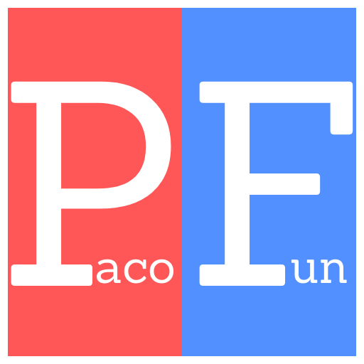

  

# PacoFun
PacoFun está inspirado en el juego de palabras PartyFun de Android pero desarrollado como PWA en web responsive para poder jugar desde cualquier dispositivo.

## Instalación:
- **Android**:  Pulsar en los 3 puntitos, añadir a la pantalla de inicio.
- **iOS**: En el navegador Safari, pulsar botón compartir y añadir a la pantalla de inicio.

### Uso:
- Añadir los jugadores, conforme se vayan añadiendo se irán repartiendo en los distintos equipos. (Posteriormente se pueden mezclar los equipos).
- Al empezar la partida, se mostrará en pantalla el nombre de un jugador (con el color de su equipo) el cual tendrá que hacer que su equipo adivine la palabra que se muestra en pantalla, sin decir esa palabra.
- No se puden decir frases, solo palabras. El equipo tiene que decir la palabra/frase completa tal y como aparece en pantalla.
- Si el equipo adivina la palabra, se pulsa el botón de acierto y se mostrará una nueva palabra, el contador de palabras restantes se decrementará y se sumará un punto al equipo.
- Si el equipo no adivina la palabra, se pulsa el botón de fallo y se mostrará una nueva palabra, el contador de palabras restantes se mantendrá igual y no se sumará ningún punto al equipo. Se restará 5 segundos al tiempo.
- Cuando se terminen las palabras, se mostrará el equipo ganador.

### Proximamente:
- Correción de bugs y actualizaciones de palabras.
- 3 rondas de juego con las mismas palabras. (De momento solo hay una ronda).
    - La primera ronda, el jugador podrá decir todas las palabras que se quieran para que el equipo adivine la respuesta.
    - La segunda solo se podrá decir una palabra.
    - La tercera solo se podrá hacer mímica.

### Contacto:

